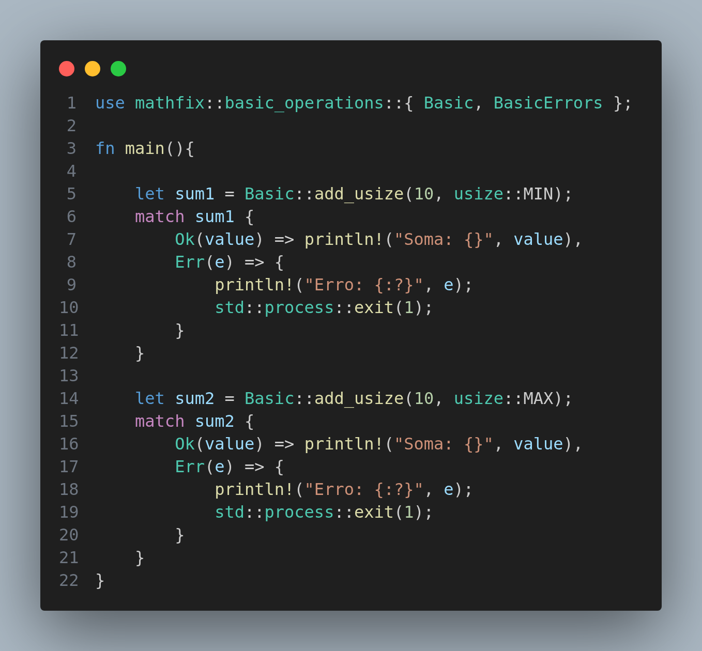

# Mathfix (Apenas para aprendizado)

## Se trata de uma simples lib que futuramente quero testar a integracao e uso em outras linguagens

### Como usar:

A principio ela so pode ser usada em um binario Rust.

Clone a Lib
```bash
git clone https://github.com/DanielDeAzevedoCordeiro1/Rust-Playground.git
```

Depois em outro terminal crie um novo projeto
```bash
cargo new "nome-do-projeto"
```

Acesso a pasta e va ate o arquivo Cargo.toml e adicione a lib para testar
```bash
[dependencies]
mathfix = { path = 'caminho-da-lib'}
```


Depois no seu main.rs chame a lib e teste
```bash
cargo run 
```



